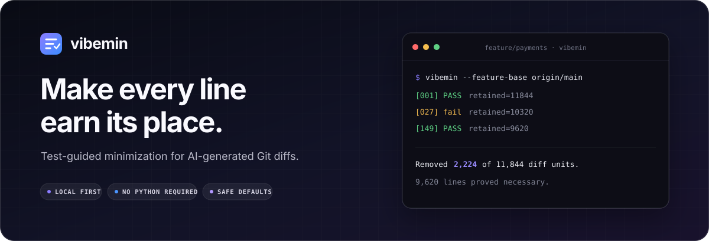

<div align="center">
  
</div>

<div align="center">

[](https://github.com/francescoVaglienti/vibemin/actions/workflows/ci.yml)
[](https://github.com/francescoVaglienti/vibemin/releases/latest)
[](https://www.python.org/)
[](pyproject.toml)
[](LICENSE)

**Test-guided minimization for AI-generated Git diffs.**

Vibemin removes code your checks cannot justify—and keeps the patch that survives.

Works with **Claude Code**, **Codex**, **GitHub Copilot**, and **Gemini CLI**—or with no
AI agent at all.

[Quick start](#quick-start) · [How it works](#how-it-works) · [Safety model](#safety-model) · [Agents](#use-it-with-your-coding-agent)

</div>

---

AI coding tools are very good at adding code. They are less disciplined about taking it
back out. Vibemin treats your Git diff as a search space and your tests as a contract,
repeatedly removing candidate lines until every remaining unit has earned its place.

> Tests are the contract. The diff is negotiable.

```console
$ vibemin --feature-base origin/main \
    --check "pytest -q" \
    --check "ruff check ."

[001] PASS  retained=11844  1.42s
[027] fail  retained=10320  1.31s
[149] PASS  retained=9620   1.26s

Removed 2,224 of 11,844 diff units in 149 checks; 9,620 remain.
```

Vibemin runs locally in a disposable Git worktree. It never sends your code anywhere,
and it only updates the real checkout after the result has passed every required check.

## Quick start

### “I don't care—just fix my agent setup”

On macOS or Linux, this is the whole setup:

```sh
curl -fsSL https://raw.githubusercontent.com/francescoVaglienti/vibemin/main/scripts/install-agent.sh | sh -s -- --everything
```

It installs the checksummed standalone CLI, finds every installed Claude Code, Codex,
GitHub Copilot, and Gemini CLI host, installs the Vibemin skill where each host expects it,
and adds a concise feature-completion rule to each detected host's global instructions.
The rule makes the agent run Vibemin after building a feature, with the relevant test, type,
security, visual, and lockfile guardrails.

The setup is safe to rerun: the skill is refreshed and the marked instruction is added only
once. With no supported agent installed, it simply leaves you with the standalone CLI.
Restart open agent sessions once so they discover the new skill and instructions.

### Choose your setup

Install only the standalone CLI—no Python and no agent configuration:

```sh
curl -fsSL https://raw.githubusercontent.com/francescoVaglienti/vibemin/main/scripts/install-binary.sh | sh
```

Install the CLI and skill for detected agents, but do not change their global instructions:

```sh
curl -fsSL https://raw.githubusercontent.com/francescoVaglienti/vibemin/main/scripts/install-agent.sh | sh
```

Choose one host explicitly, and optionally wire in automatic feature completion:

```sh
# claude, codex, copilot, or gemini
curl -fsSL https://raw.githubusercontent.com/francescoVaglienti/vibemin/main/scripts/install-agent.sh | sh -s -- --agent codex

# The same, plus its global feature-completion instruction
curl -fsSL https://raw.githubusercontent.com/francescoVaglienti/vibemin/main/scripts/install-agent.sh | sh -s -- --agent codex --configure
```

Preinstall the skill and instruction for all four hosts, including ones not installed yet:

```sh
curl -fsSL https://raw.githubusercontent.com/francescoVaglienti/vibemin/main/scripts/install-agent.sh | sh -s -- --agent all --configure
```

Or install the Python package from [PyPI](https://pypi.org/project/vibemin/):

```sh
uv tool install vibemin
```

Self-contained executables for macOS, Linux, and Windows are also available on the
[Releases page](https://github.com/francescoVaglienti/vibemin/releases/latest).

### Minimize your feature

Run a preview from the feature's merge-base with the target branch:

```sh
vibemin --feature-base origin/main --dry-run \
  --check "npm test -- --run" \
  --check "npm run lint" \
  --check "npm run typecheck"
```

Review the proposal, then repeat without `--dry-run` to apply it. Vibemin writes only the
verified result back as working-tree changes, ready for a final review and commit. Your agent
skill derives the appropriate commands and additional guards from the repository for you.

## Built for agentic code

| Capability | What it gives you |
| --- | --- |
| **Feature-wide reduction** | Minimize committed and uncommitted work together from a branch merge-base. |
| **Behavior-preserving search** | Every accepted candidate must pass the checks you supplied. |
| **Safe test reduction** | Tests stay fixed unless you opt in with collection or mutation-strength protection. |
| **Visual protection** | Styles and assets stay fixed without a deterministic rendered-output oracle. |
| **Dependency protection** | Manifests and lockfiles require an explicit consistency check before reduction. |
| **Type and security gates** | TypeScript and security-sensitive changes require the checks that can actually validate them. |
| **Local by design** | No service, account, telemetry, or runtime dependency is required. |

## How it works

1. **Read the diff.** Vibemin turns inserted and deleted lines into removable units.
2. **Build a sandbox.** Candidate patches run in a temporary detached Git worktree.
3. **Search by subtraction.** Groups of units are removed using delta debugging.
4. **Verify every candidate.** Tests, linters, type checks, and output contracts decide what survives.
5. **Apply once.** Only the final verified patch is written to your checkout.

The result is *1-minimal under the supplied checks*: no remaining individual unit was
shown to be removable. It is not a claim that the implementation is globally shortest,
and weak checks can still permit an incorrect reduction.

## Safety model

Green unit tests alone do not prove that tests, lockfiles, or rendered output survived.
Vibemin protects the easy-to-game parts of a patch by default.

| Change category | Default | Explicit unlock |
| --- | --- | --- |
| Tests, specs, snapshots | Protected | `--reduce-tests` plus `--test-strength-check` or `--preserve-output` |
| Dependency manifests and lockfiles | Protected | `--allow-dependency-changes` plus `--dependency-check` |
| Styles, fonts, icons, images | Protected | `--allow-visual-changes` plus deterministic `--preserve-output` |
| TypeScript | Typecheck required | `--allow-untyped-typescript` |
| Auth, tenant, token, session, secret code | Security oracle required | `--security-check` |
| Expensive broad validation | Run once on the winner | `--final-check` |

These defaults prevent misleading wins such as deleting assertions until the suite passes,
removing CSS because a non-visual build stays green, or drifting a lockfile away from its
manifest. Vibemin reports every protected file as fixed context.

## Recipes

### Minimize selected paths

```sh
vibemin src/new-feature \
  --check "npm test -- --run tests/new-feature.test.ts" \
  --check "npm run lint"
```

### Minimize a whole feature

`--feature-base` finds the merge-base, so unrelated target-branch history is excluded.
Use `--base REF` when you want an exact baseline instead.

```sh
vibemin --feature-base origin/main \
  --check "pytest -q" \
  --final-check "pytest -q tests/integration"
```

### Reduce tests without weakening them

Preserve the collected test inventory when simplifying test bodies:

```sh
vibemin tests --reduce-tests \
  --check "pytest -q" \
  --preserve-output "pytest --collect-only -q | sed '/collected in/d'"
```

When intentionally merging overlapping cases, collection output must change. Protect the
mutation score or killed-mutant set instead:

```sh
vibemin tests --reduce-tests \
  --check "pytest -q" \
  --test-strength-check "./scripts/check-mutation-baseline"
```

Coverage alone does not preserve assertion strength.

### Preserve a rendered contract

```sh
vibemin web/src --allow-visual-changes \
  --check "npm run build" \
  --preserve-output "./scripts/render-reference-screenshot --hash"
```

`--preserve-output` records deterministic stdout and stderr from the first verified
candidate and requires an exact match from every smaller one. It also works well for API
schemas, generated interfaces, and CLI snapshots.

### Validate dependency changes

```sh
vibemin pyproject.toml uv.lock --allow-dependency-changes \
  --check "pytest -q" \
  --dependency-check "uv lock --check"
```

### Preview without applying

```sh
vibemin --dry-run \
  --check "pytest -q" \
  --check "ruff check ."
```

## CLI essentials

| Option | Purpose |
| --- | --- |
| `-c, --check COMMAND` | Add a fast, non-mutating acceptance check; repeatable and required. |
| `-p, --preserve-output COMMAND` | Preserve deterministic command output exactly. |
| `--final-check COMMAND` | Run an expensive clean-install or broad check on the winner. |
| `--feature-base REF` | Include the entire feature since `merge-base HEAD REF`. |
| `--base REF` | Use an exact baseline instead of `HEAD`. |
| `--max-attempts N` | Bound the number of candidate checks; defaults to 500. |
| `--timeout SECONDS` | Bound each command; defaults to 300 seconds. |
| `--dry-run` | Find the result without changing the checkout. |
| `--verbose` | Show output from failed candidate checks. |

Run `vibemin --help` for the complete command reference.

## Guardrails and limitations

- Staged changes are rejected so the index and working tree cannot diverge unexpectedly.
- Symlinks and changed directories or submodules are currently rejected.
- Ignored local files such as `.env`, `.venv`, and `node_modules` are not copied into the
  temporary worktree. Prefer globally available tools or shared package-manager caches.
- Checks must be non-mutating and run from the root of the temporary worktree.
- Untracked, non-ignored files are included. Files outside explicit path arguments remain
  available as fixed context.
- Binary files and empty-file changes are atomic reduction units.

Always review the final diff. Vibemin knows only what the checks prove.

## Agent setup reference

Agent integration has two small parts: the skill teaches *how* to minimize safely, while the
optional feature-completion instruction says *when* to use it. Vibemin itself remains a local
standalone CLI; no AI subscription, model API, account, or telemetry is required.

The automatic setup only appends its clearly marked Vibemin block. It never rewrites existing
agent instructions, and rerunning it does not duplicate the block.

| Agent | Personal skill | `--configure` instruction |
| --- | --- | --- |
| Claude Code | `~/.claude/skills/vibemin/SKILL.md` | `~/.claude/CLAUDE.md` |
| Codex | `~/.agents/skills/vibemin/SKILL.md` | `~/.codex/AGENTS.md` |
| GitHub Copilot | `~/.agents/skills/vibemin/SKILL.md` | `~/.copilot/copilot-instructions.md` |
| Gemini CLI | `~/.agents/skills/vibemin/SKILL.md` | `~/.gemini/GEMINI.md` |

Codex, Copilot, and Gemini share the open Agent Skills location, so the installer keeps one
copy rather than three duplicates. Claude uses its own skill directory. An explicit agent
choice is safe when that host is absent: its files are ready for the next launch.

### Installer modes

| Mode | Result |
| --- | --- |
| No arguments | Detect hosts and install their skill; ask which one on an interactive multi-host setup. |
| `--everything` | Install and configure every detected host without asking. |
| `--agent codex` | Install for one named host, even if it is not installed yet. |
| `--agent codex --configure` | Install one host and add its global feature-completion instruction. |
| `--agent all --configure` | Preconfigure every supported host. |
| `--agent standalone` | Install no agent files; use only the CLI. |

Accepted host names are `claude`, `codex`, `copilot`, and `gemini`. The same options work
with the curl bootstrap and with `scripts/install-user.sh` from a checkout.

### Team-shared instructions

`--configure` is personal machine setup. To make feature completion a repository policy,
commit the same rule to the host's project instruction file:

| Agent | Repository instruction file |
| --- | --- |
| Claude Code | [`CLAUDE.md`](https://code.claude.com/docs/en/memory#claudemd-files) |
| Codex | [`AGENTS.md`](https://learn.chatgpt.com/docs/agent-configuration/agents-md) |
| GitHub Copilot | [`.github/copilot-instructions.md`](https://docs.github.com/en/copilot/how-tos/copilot-on-github/customize-copilot/add-custom-instructions/add-repository-instructions) |
| Gemini CLI | [`GEMINI.md`](https://geminicli.com/docs/cli/gemini-md/) |

Keep that rule short: run the Vibemin skill after implementation, use the full feature diff,
derive checks from the repository, preserve protected files, and review the final result.
The installed skill owns the detailed procedure so it does not need to live in every prompt.

### Install from source

Use a checkout when developing Vibemin itself:

```sh
git clone https://github.com/francescoVaglienti/vibemin.git
cd vibemin
./scripts/install-user.sh
```

In standalone mode you run `vibemin` directly and supply the checks on the command line;
there is no model, API key, or agent involved:

```sh
vibemin --check "pytest -q" --check "ruff check ."
```

## Development

```sh
git clone https://github.com/francescoVaglienti/vibemin.git
cd vibemin
uv run --with pytest pytest -q
uv run --with ruff ruff check .
uv run --with ruff ruff format --check .
```

The suite favors integration evidence over internal implementation tests: it exercises real
Git repositories, runs release executables end to end, and makes Vibemin minimize its own
source while its focused test suite acts as the oracle.

Source installs target Python 3.10+ and have no runtime dependencies. Release executables
bundle their own Python runtime.

## License

[MIT](LICENSE) © Francesco Vaglienti
